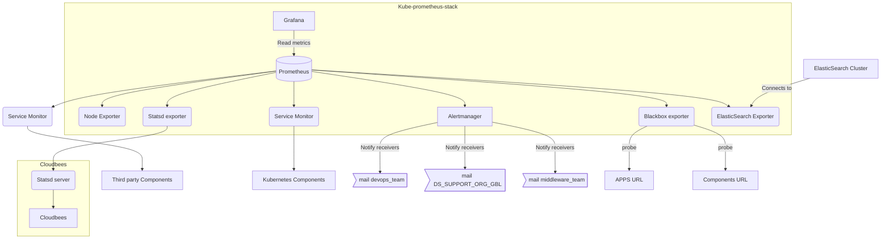
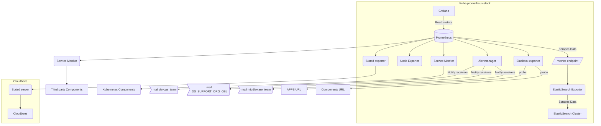
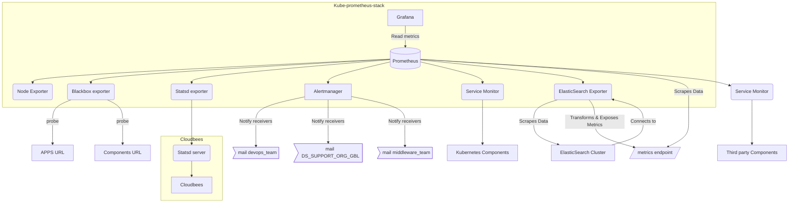
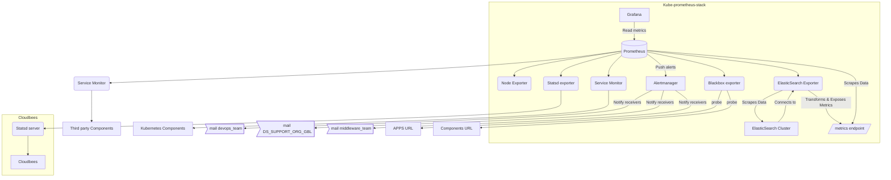
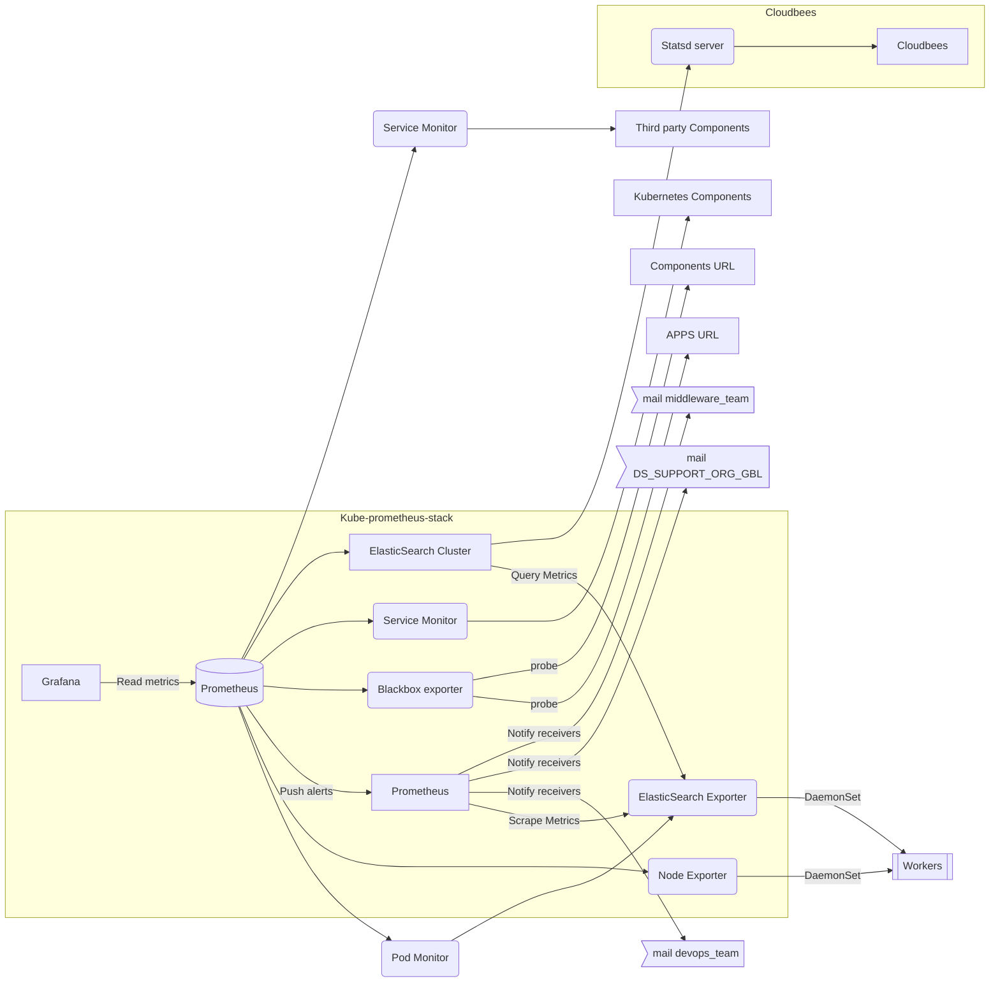
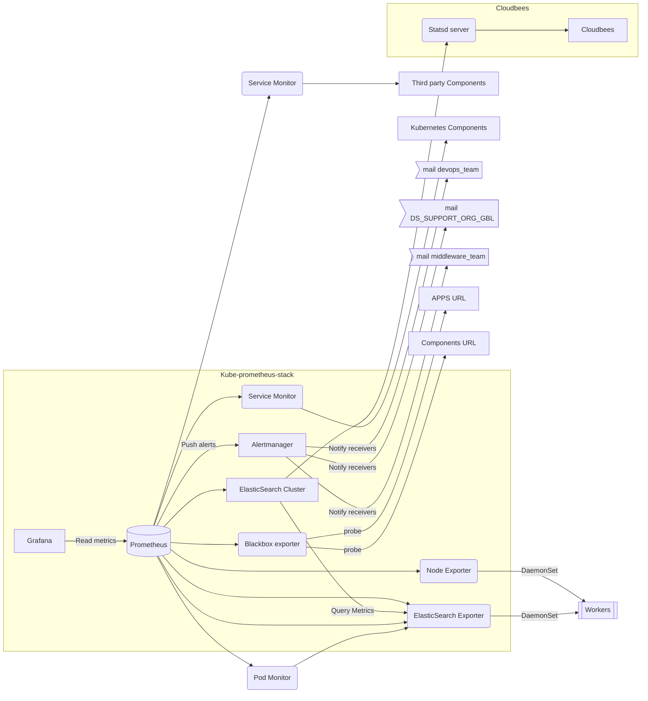

### Rendered Diagram (in Mermaid.js format)




### Rendered Diagram (in Mermaid.js format)




# Monitoring Stack Diagram





Sure, here's a comprehensive document for the ElasticSearch Exporter:

# ElasticSearch Exporter

## Overview
The ElasticSearch exporter collects metrics from an ElasticSearch cluster and exports them as Prometheus metrics. It helps monitor various aspects of ElasticSearch, including cluster health, node statistics, and index performance.

## Architecture
The ElasticSearch exporter runs as a standalone application that queries the ElasticSearch cluster and exposes the metrics in a format that Prometheus can scrape.

# Monitoring Stack Diagram



## Deployment
The ElasticSearch exporter is deployed using a Helm chart. It is integrated into the existing monitoring stack managed by Prometheus.

### Steps for Deployment
1. **Add Definition to Internal Inventory**: Ensure the ElasticSearch exporter definition is included in internal_releases.yml, internal_stacks.yml, internal_components.yml, and component_prometheus.yml.
2. **Run Playbook**: Use the generic deployment playbook to deploy the ElasticSearch exporter.

### Helm Chart Configuration
The deployment and configuration of the ElasticSearch exporter are managed using a Helm values file.

- **Proxy Configuration**: ✔️
- **ServiceMonitor**: ✔️

## Configuration

### Helm Values File
The main configuration for the ElasticSearch exporter is managed via the Helm values file. Below are the key configurations:

- **ElasticSearch URL**: URL of the ElasticSearch cluster to monitor.
- **Basic Auth**: Credentials for accessing the ElasticSearch cluster if authentication is enabled.
- **TLS Config**: Configuration for secure communication.
- **Metrics Path**: Path where the exporter will expose metrics (default: `/metrics`).

### Example Values File
```yaml
elasticsearch:
  url: "http://elasticsearch.example.com:9200"
  auth:
    username: "user"
    password: "password"
  tls:
    enabled: true
    certFile: /path/to/cert.crt
    keyFile: /path/to/key.key
metrics:
  path: "/metrics"
serviceMonitor:
  enabled: true
  namespace: "monitoring"
  labels:
    release: "prometheus-operator"
```

## Maintenance

### Updating the Exporter
To update the ElasticSearch exporter:
1. **Update Helm Chart**: Fetch the latest version of the Helm chart.
2. **Apply Changes**: Use `helm upgrade` to apply changes to the existing deployment.
3. **Validate**: Ensure the exporter is running and Prometheus is scraping the metrics correctly.

### Troubleshooting
- **Logs**: Check logs of the exporter pod for any errors or warnings.
- **Metrics Endpoint**: Verify that the metrics endpoint is accessible and returning metrics.
- **Prometheus Targets**: Ensure the target is correctly configured and Prometheus is able to scrape it.

## Status
The current release of the ElasticSearch exporter is stable.

## Revision History

| Version | Description                     | Author | Effective Date d.m.y |
| ------- | ------------------------------- | ------ | -------------------- |
| 1.0.0   | Initial version                 | CHT    | 11.04.2023           |
| 1.0.1   | Added Helm chart configuration  | RBA    | 13.09.2023           |

## Related Resources

- **ElasticSearch Exporter Repository**: [GitHub Link](https://github.com/prometheus-community/elasticsearch_exporter)
- **Helm Chart Repository**: [Helm Chart Link](https://github.com/prometheus-community/helm-charts/tree/main/charts/elasticsearch-exporter)
- **Prometheus Documentation**: [Prometheus.io](https://prometheus.io/docs/introduction/overview/)

This document provides an overview of the ElasticSearch exporter, including its architecture, deployment, configuration, and maintenance, ensuring effective monitoring of ElasticSearch clusters within a Prometheus-based monitoring stack.


graph LR
  B --> PM(Pod Monitor)
  PM --> F(Prerequisite exporter)
  F -->|DaemonSet| Worker[[Workers]]
  C -->|DaemonSet| Worker

  subgraph "Kube-prometheus-stack"
  A[Grafana]-->|Read metrics| B[(Prometheus)]
  B --> C(Node Exporter)
  B -->|Push alerts| G[Alertmanager]
  B --> D(Blackbox exporter)
  B --> SM1(Service Monitor)
  B --> E(Statsd exporter)
  B --> ESE(ElasticSearch Exporter)
  end
  
  B --> SM2(Service Monitor)
  SM2 --> O[Third party Components]
  SM1 --> P[Kubernetes Components]
  G -->|Notify receivers| H>mail devops_team]
  G -->|Notify receivers| I>mail DS_SUPPORT_ORG_GBL]
  G -->|Notify receivers| J>mail middleware_team]
  D -->|probe| L[APPS URL]
  D -->|probe| M[Components URL]

  subgraph "Cloudbees"
  N(Statsd server) --> K[Cloudbees]
  E --> N
  end
  
  ESE --> ES[ElasticSearch Cluster]


Here's a revised version of your mermaid graph with correct technical placements of the ElasticSearch components within the "Kube-prometheus-stack" subgraph. This shows how the ElasticSearch cluster interacts with the ElasticSearch exporter and how Prometheus scrapes metrics from it, including the complete structure of the monitoring stack:

```markdown
# Monitoring Stack Diagram


### Explanation of the Diagram:

- **Kube-prometheus-stack**:
  - **Grafana** reads metrics from **Prometheus**.
  - **Prometheus** collects metrics from:
    - **Node Exporter** (via DaemonSet)
    - **Prerequisite Exporter** (via DaemonSet)
    - **Blackbox Exporter**
    - **Statsd Exporter**
    - **ElasticSearch Exporter**
  - **ElasticSearch Cluster** sends metrics to the **ElasticSearch Exporter**.
  - **Prometheus** scrapes metrics from the **ElasticSearch Exporter**.
  - **Prometheus** uses **Pod Monitor** and **Service Monitors** to scrape metrics from Kubernetes and third-party components.
  - **Prometheus** sends alerts to **Alertmanager**.
  - **Alertmanager** notifies various receivers via email.
  - **Blackbox Exporter** probes application URLs and component URLs.

- **Cloudbees**:
  - **Statsd Server** within Cloudbees sends metrics to **Cloudbees**.
  - **Statsd Exporter** sends metrics to **Statsd Server**.

When you include this code in a Markdown file and view it in a mermaid.js-compatible viewer, it should render the updated and technically correct diagram. Here is the complete Markdown file content:


# Monitoring Stack Diagram



This should provide a clear and accurate depiction of your monitoring stack including the ElasticSearch components.
