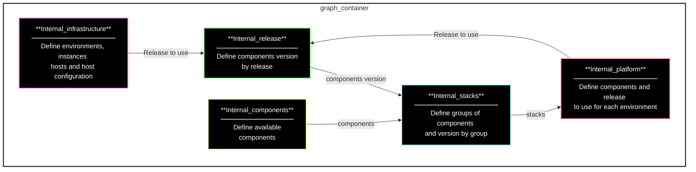

This diagram correctly represents the flow you described, with each component pointing to the appropriate next step in the sequence.


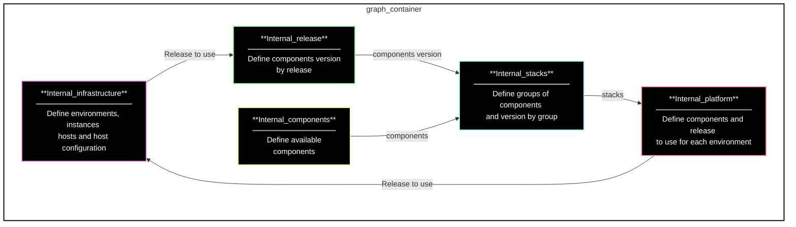

This diagram now accurately represents the corrected flow, with "Internal_platform" pointing to "Internal_infrastructure".


To make "Internal_infrastructure" the top and first box from the top, you need to adjust the order of nodes and their connections accordingly. Here's the updated diagram:

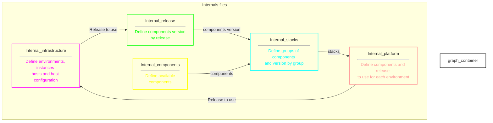
black with white text by default. Adjust the colors and styles further as needed.


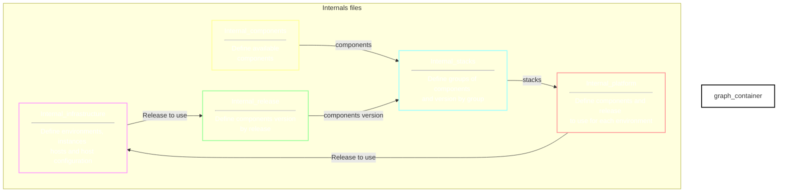

In this version:
- The outer border of the subgraph ("Internals files") is set to black with `stroke:#000` and `fill:transparent` ensures the inside of the subgraph is transparent.
- Each node (`A`, `B`, `C`, `D`, `E`) has a transparent fill with `fill:transparent` and retains the colorful borders.

This configuration should provide a colorful outer border with transparent inner nodes, making the internal contents visible through the transparent fill.

To make the outer border of the subgraph colorless while keeping the inner elements styled, you can adjust the subgraph style to make the fill and stroke transparent. Here's the corrected version:

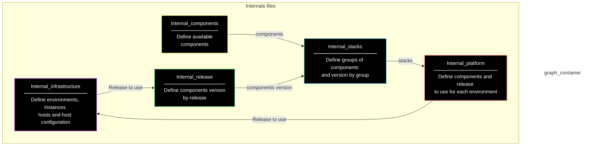

In this version:
- `style graph_container fill:transparent, stroke:transparent, stroke-width:2px, stroke-dasharray: 0;` makes both the fill and the stroke of the subgraph container transparent, effectively removing the outer border.
- The individual styles for nodes (`A`, `B`, `C`, `D`, `E`) are retained as specified.

This setup should now render the subgraph without a visible outer border, while the nodes inside the subgraph will still have their specified styles and relationships.


To create a colorful two-line border with a transparent fill inside the subgraph in your Mermaid diagram, you can adjust the styles as follows:

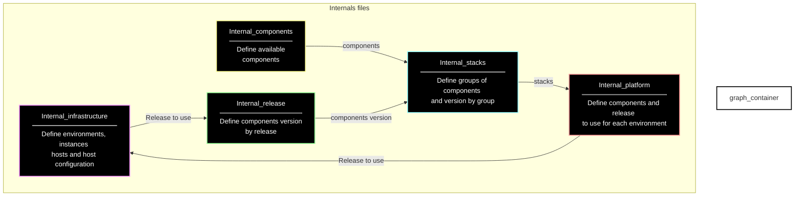


To make the border transparent for the `Internals files` subgraph and adjust the styling of the nodes (`A` to `E`), here's the corrected Mermaid diagram syntax:


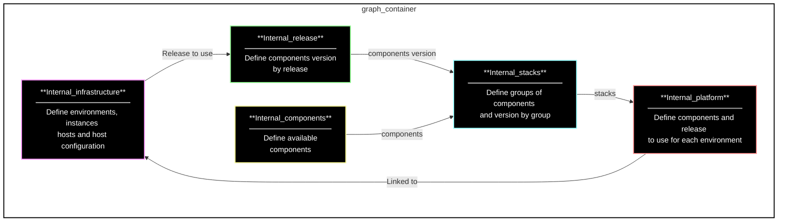


To achieve a transparent background for the overall diagram container and a double-lined border, you need to adjust the `graph_container` style and the individual node styles accordingly. Here's how you can modify the Mermaid code:


### Explanation:
- `style graph_container fill:transparent, stroke:#000, stroke-width:2px, stroke-dasharray: 0;` sets the overall container (`graph_container`) to have a transparent fill (`fill:transparent`), a black border (`stroke:#000`), with a stroke width of `2px` and no dash pattern (`stroke-dasharray: 0`).
- `style A`, `style B`, `style C`, `style D`, `style E` specify the fill color (`fill:#000` for black background), stroke color (`stroke`), stroke width (`stroke-width:2px`), no dash pattern (`stroke-dasharray: 0`), and text color (`color:#fff` for white text).
- The `<hr>` tags in the node labels provide a horizontal line to visually separate the heading from the content.

This should render the diagram with a transparent background, double-lined border, and the specified styles for each node. Adjust the styles further if needed based on your specific preferences or additional requirements.

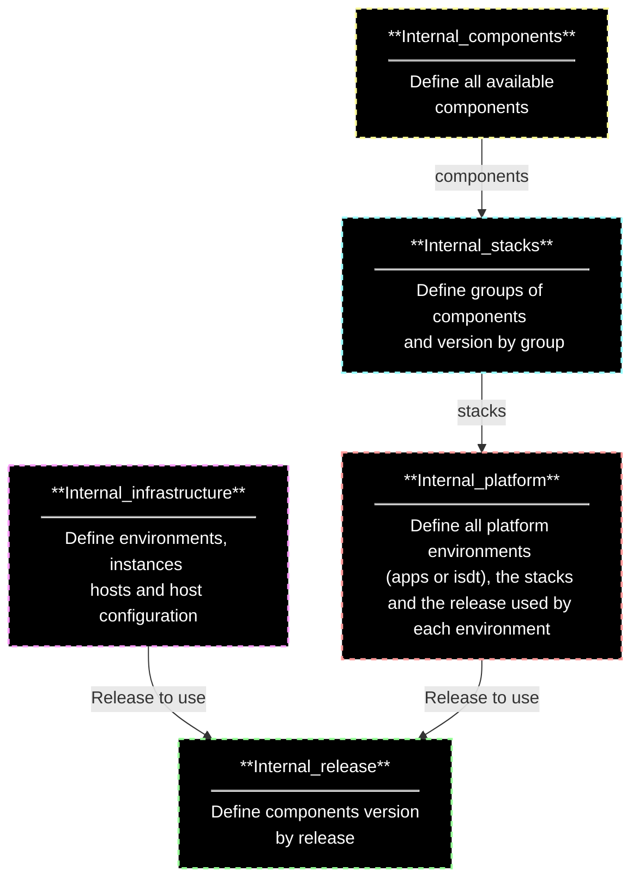

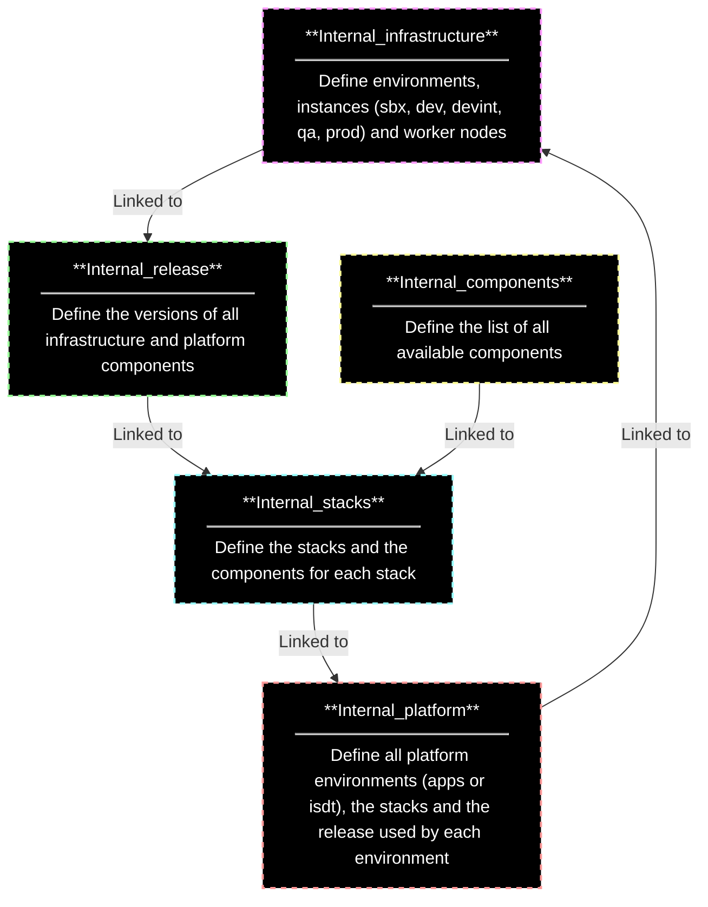


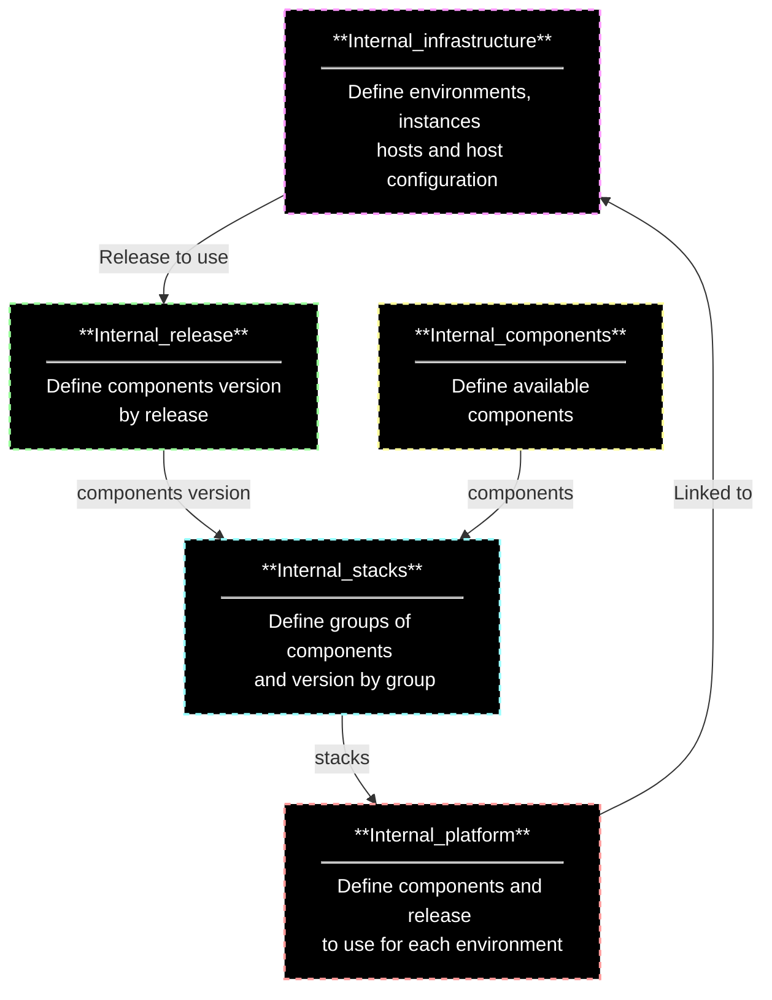


It seems there was a syntax issue in the previous attempt to render the Mermaid diagrams. Let's correct it:

### First Diagram

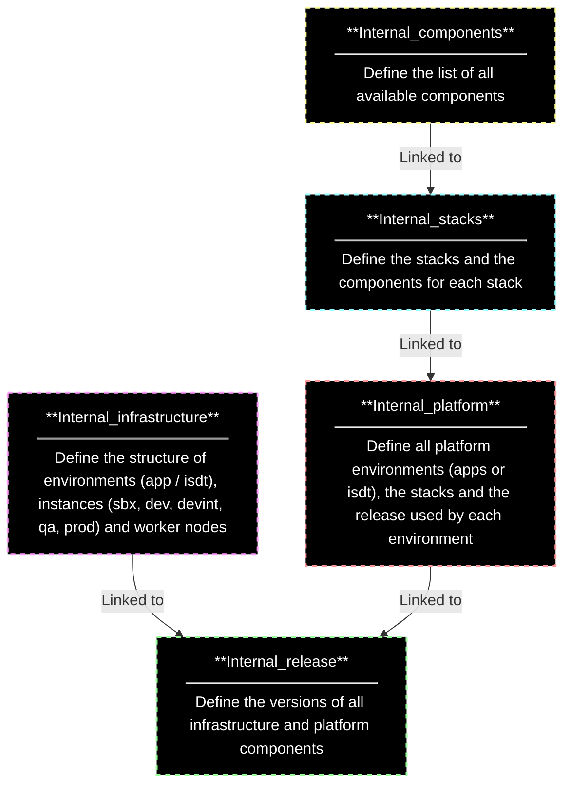

### Second Diagram (Enclosed in a Subgraph)

```mermaid
graph TD
  style A fill:#000,stroke:#f9f,stroke-width:2px,stroke-dasharray: 5, 5,color:#fff
  style B fill:#000,stroke:#9f9,stroke-width:2px,stroke-dasharray: 5, 5,color:#fff
  style C fill:#000,stroke:#ff9,stroke-width:2px,stroke-dasharray: 5, 5,color:#fff
  style D fill:#000,stroke:#9ff,stroke-width:2px,stroke-dasharray: 5, 5,color:#fff
  style E fill:#000,stroke:#f99,stroke-width:2px,stroke-dasharray: 5, 5,color:#fff
  
  subgraph ""
    style graph stroke:#ccc,stroke-width:2px,stroke-dasharray: 0
    A["**Internal_infrastructure**<br/><hr style='margin-top: 8px; margin-bottom: 8px;'/>Define the structure of environments (app / isdt), instances (sbx, dev, devint, qa, prod) and worker nodes"] -->|Linked to| B["**Internal_release**<br/><hr style='margin-top: 8px; margin-bottom: 8px;'/>Define the versions of all infrastructure and platform components"]
    C["**Internal_components**<br/><hr style='margin-top: 8px; margin-bottom: 8px;'/>Define the list of all available components"] -->|Linked to| D["**Internal_stacks**<br/><hr style='margin-top: 8px; margin-bottom: 8px;'/>Define the stacks and the components for each stack"]
    D -->|Linked to| E["**Internal_platform**<br/><hr style='margin-top: 8px; margin-bottom: 8px;'/>Define all platform environments (apps or isdt), the stacks and the release used by each environment"]
    E -->|Linked to| B
  end
```

### Notes:
- Each diagram has been corrected for proper Mermaid syntax.
- The first diagram defines boxes with black backgrounds (`fill:#000`) and colorful borders (`stroke` properties).
- The second diagram is enclosed in a subgraph (`subgraph ""`) with a gray border (`stroke:#ccc`) around the entire content.
- Each box in both diagrams contains bold headings (`**Heading**`) and content separated by horizontal lines (`<hr>`).

Ensure your Mermaid environment supports the syntax correctly, or consider using a Mermaid live editor for accurate visualization.

```mermaid
graph TD
  style A fill:#000,stroke:#f9f,stroke-width:2px,stroke-dasharray: 5, 5,color:#fff
  style B fill:#000,stroke:#9f9,stroke-width:2px,stroke-dasharray: 5, 5,color:#fff
  style C fill:#000,stroke:#ff9,stroke-width:2px,stroke-dasharray: 5, 5,color:#fff
  style D fill:#000,stroke:#9ff,stroke-width:2px,stroke-dasharray: 5, 5,color:#fff
  style E fill:#000,stroke:#f99,stroke-width:2px,stroke-dasharray: 5, 5,color:#fff
  
  subgraph ""
    style graph-container stroke:#ccc,stroke-width:2px,stroke-dasharray: 0
    A["**Internal_infrastructure**<br/><hr style='margin-top: 8px; margin-bottom: 8px;'/>Define the structure of environments (app / isdt), instances (sbx, dev, devint, qa, prod) and worker nodes"] -->|Linked to| B["**Internal_release**<br/><hr style='margin-top: 8px; margin-bottom: 8px;'/>Define the versions of all infrastructure and platform components"]
    C["**Internal_components**<br/><hr style='margin-top: 8px; margin-bottom: 8px;'/>Define the list of all available components"] -->|Linked to| D["**Internal_stacks**<br/><hr style='margin-top: 8px; margin-bottom: 8px;'/>Define the stacks and the components for each stack"]
    D -->|Linked to| E["**Internal_platform**<br/><hr style='margin-top: 8px; margin-bottom: 8px;'/>Define all platform environments (apps or isdt), the stacks and the release used by each environment"]
    E -->|Linked to| B
  end
```


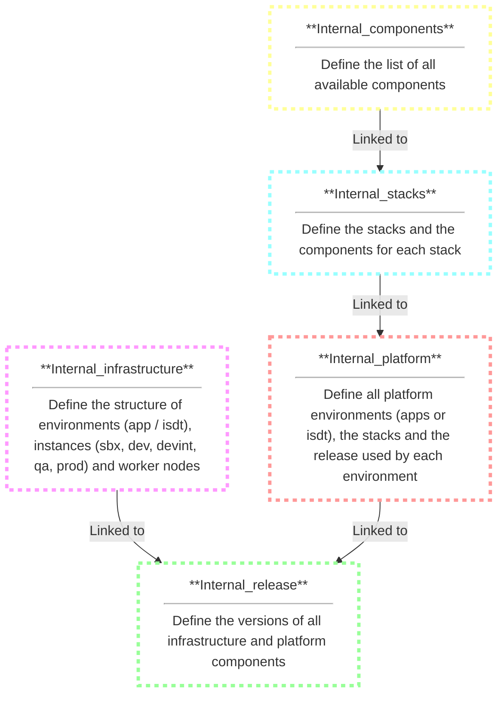

```mermaid
graph TD
  style A fill:#fff,stroke:#f9f,stroke-width:4px,stroke-dasharray: 5, 5
  style B fill:#fff,stroke:#9f9,stroke-width:4px,stroke-dasharray: 5, 5
  style C fill:#fff,stroke:#ff9,stroke-width:4px,stroke-dasharray: 5, 5
  style D fill:#fff,stroke:#9ff,stroke-width:4px,stroke-dasharray: 5, 5
  style E fill:#fff,stroke:#f99,stroke-width:4px,stroke-dasharray: 5, 5
  
  A["Internal_infrastructure<br/>define the structure of environments (app / isdt), instances (sbx, dev, devint, qa, prod) and worker nodes"] -->|Linked to| B["Internal_release<br/>define the versions of all infrastructure and platform components"]
  C["Internal_components<br/>define the list of all available components"] -->|Linked to| D["Internal_stacks<br/>define the stacks and the components for each stack"]
  D -->|Linked to| E["Internal_platform<br/>define all platform environments (apps or isdt), the stacks and the release used by each environment"]
  E -->|Linked to| B
```


```mermaid
graph TD
  style A fill:#fff,stroke:#f9f,stroke-width:4px
  style B fill:#fff,stroke:#9f9,stroke-width:4px
  style C fill:#fff,stroke:#ff9,stroke-width:4px
  style D fill:#fff,stroke:#9ff,stroke-width:4px
  style E fill:#fff,stroke:#f99,stroke-width:4px

  A[Internal_infrastructure] -->|Linked to| B[Internal_release]
  C[Internal_components] -->|Linked to| D[Internal_stacks]
  D -->|Linked to| E[Internal_platform]
  E -->|Linked to| B
```


```mermaid
graph LR
  style A fill:#f9f,stroke:#333,stroke-width:4px
  style B fill:#9f9,stroke:#333,stroke-width:4px
  style C fill:#ff9,stroke:#333,stroke-width:4px
  style D fill:#9ff,stroke:#333,stroke-width:4px
  style E fill:#f99,stroke:#333,stroke-width:4px

  A[Internal_infrastructure] -->|Linked to| B[Internal_release]
  C[Internal_components] -->|Linked to| D[Internal_stacks]
  D -->|Linked to| E[Internal_platform]
  E -->|Linked to| B
```


```mermaid
graph LR
  A[Internal_infrastructure]
  B[Internal_release]
  C[Internal_components]
  D[Internal_stacks]
  E[Internal_platform]
  
  A-->B
  C-->D
  D-->E
  E-->B
```

```mermaid
graph TD
  subgraph "Kube-prometheus-stack"
    A[Grafana]-->|query and visualize| B[(Prometheus)]
    B --> C(Node Exporter)
    B --> D(Blackbox exporter)
    B --> E(Statsd exporter)
    B --> G[Alertmanager]
    B --> SM1(Service Monitor)
    B --> EE1(ElasticSearch Exporter)
  end
  
  B --> SM2(Service Monitor)
  B --> EE2(ElasticSearch Cluster)
  SM2 --> O[Third party Components]
  SM1 --> P[Kubernetes Components]
  EE1 -->|Crawl & expose and pull| R[ElasticSearch Cluster]

  G -->|Notify receivers| H[mail devops_team]
  G -->|Notify receivers| I[mail DS_SUPPORT_ORG_GBL]
  G -->|Notify receivers| J[mail middleware_team]
  D -->|probe| L[APPS URL]
  D -->|probe| M[Components URL]
  F -->|probe| L[APPS URL]

  subgraph "Cloudbees"
    E --> N(Statsd server)
    N --> K[Cloudbees]
  end
```


```mermaid
graph LR
  G[Grafana]-->|query and visualize| P(Prometheus)
  P -->|pull| F(ElasticSearch Exporter)
  F -->|crawl & expose| E[ElasticSearch Cluster]
```


```mermaid
graph LR
  E[ElasticSearch Cluster]-->|crawl & expose| F(ElasticSearch Exporter)
  F -->|pull| P(Prometheus)
  P -->|query and visualize| G[Grafana]
```

```mermaid
graph LR
  A[ElasticSearch Cluster] -->|Crawls Metrics (Bidirectional)| B[ElasticSearch Exporter]
  B -->|Exposes Metrics (Endpoint)| B2
  C[Prometheus] -->|Scrapes Metrics| B2
  C -->|Stores Metrics (Time-Series DB)| D[Prometheus Storage]
  E[Grafana] -->|Queries Metrics| C
  E -->|Creates Dashboards & Alerts| E2

  subgraph "Data Flow"
    A --> B
    B --> B2
    C --> B2
    C --> D
    E --> C
  end
```


```mermaid
graph LR
  subgraph "Exporting data to ElasticSearch"
    A[Monitoring System (Prometheus, Grafana Agent etc.)] --> B[Metrics]
    B --> C[Elasticsearch Exporter]
    C --> D[Elasticsearch Cluster]
  end
  
  subgraph "Additional Data Sources"
    E[Statsd server] --> F[Statsd exporter]
    F --> B
  end
  
  subgraph "Alerting"
    B --> G[Alertmanager]
    G --> H[Notify DevOps Team]
    G --> I[Notify DS_SUPPORT_ORG_GBL]
    G --> J[Notify Middleware Team]
  end
  
  subgraph "Probes (Optional)"
    B --> K[Blackbox exporter]
    K --> L[External Applications (URLs)]
  end
```

```mermaid
graph TD
  subgraph "Kube-prometheus-stack"
    A[Grafana]-->|Read metrics| B[(Prometheus)]
    B --> C(Node Exporter)
    B --> D(Blackbox exporter)
    B --> E(Statsd exporter)
    B --> G[Alertmanager]
    B --> SM1(Service Monitor)
    B --> F(ElasticSearch Exporter)
  end

  E1[ElasticSearch Cluster]-->|Connects to| F
  B --> SM2(Service Monitor)
  SM2 --> O[Third party Components]
  SM1 --> P[Kubernetes Components]

  G -->|Notify receivers| H>mail devops_team]
  G -->|Notify receivers| I>mail DS_SUPPORT_ORG_GBL]
  G -->|Notify receivers| J>mail middleware_team]
  D -->|probe| L[APPS URL]
  D -->|probe| M[Components URL]

  subgraph "Cloudbees"
    E --> N(Statsd server)
    N --> K[Cloudbees]
  end
```

```mermaid
graph TD
  subgraph "Kube-prometheus-stack"
    A[Grafana]-->|Read metrics| B[(Prometheus)]
    B --> C(Node Exporter)
    B --> D(Blackbox exporter)
    B --> E(Statsd exporter)
    B --> G[Alertmanager]
    B --> SM1(Service Monitor)
    B --> F(ElasticSearch Exporter)
  end
  
  E1[ElasticSearch Cluster]-->|Connects to| F
  F -->|Scrapes Data| E1
  F -->|Transforms & Exposes Metrics| F2[/metrics endpoint/]
  B -->|Scrapes Data| F2
  B --> SM2(Service Monitor)
  SM2 --> O[Third party Components]
  SM1 --> P[Kubernetes Components]
  
  G -->|Notify receivers| H>mail devops_team]
  G -->|Notify receivers| I>mail DS_SUPPORT_ORG_GBL]
  G -->|Notify receivers| J>mail middleware_team]
  D -->|probe| L[APPS URL]
  D -->|probe| M[Components URL]

  subgraph "Cloudbees"
    E --> N(Statsd server)
    N --> K[Cloudbees]
  end
```


### Rendered Diagram (in Mermaid.js format)

```mermaid
graph TD
  subgraph "Kube-prometheus-stack"
    A[Grafana]-->|Read metrics| B[(Prometheus)]
    B -->|Scrapes Data| F2[/metrics endpoint/]
    F2 --> F(ElasticSearch Exporter)
    F -->|Scrapes Data| E1[ElasticSearch Cluster]
    B --> C(Node Exporter)
    B --> D(Blackbox exporter)
    B --> E(Statsd exporter)
    B --> G[Alertmanager]
    B --> SM1(Service Monitor)
  end

  B --> SM2(Service Monitor)
  SM2 --> O[Third party Components]
  SM1 --> P[Kubernetes Components]
  
  G -->|Notify receivers| H>mail devops_team]
  G -->|Notify receivers| I>mail DS_SUPPORT_ORG_GBL]
  G -->|Notify receivers| J>mail middleware_team]
  
  D -->|probe| L[APPS URL]
  D -->|probe| M[Components URL]

  subgraph "Cloudbees"
    E --> N(Statsd server)
    N --> K[Cloudbees]
  end
```


### Rendered Diagram (in Mermaid.js format)

```mermaid
graph TD
  subgraph "Kube-prometheus-stack"
    A[Grafana]-->|Read metrics| B[(Prometheus)]
    B --> C(Node Exporter)
    B --> D(Blackbox exporter)
    B --> E(Statsd exporter)
    B --> G[Alertmanager]
    B --> SM1(Service Monitor)
    B --> F(ElasticSearch Exporter)
  end
  
  E1[ElasticSearch Cluster]-->|Connects to| F
  F -->|Scrapes Data| E1
  F -->|Transforms & Exposes Metrics| F2[/metrics endpoint/]
  B -->|Scrapes Data| F2
  B --> SM2(Service Monitor)
  SM2 --> O[Third party Components]
  SM1 --> P[Kubernetes Components]
  
  G -->|Notify receivers| H>mail devops_team]
  G -->|Notify receivers| I>mail DS_SUPPORT_ORG_GBL]
  G -->|Notify receivers| J>mail middleware_team]
  D -->|probe| L[APPS URL]
  D -->|probe| M[Components URL]

  subgraph "Cloudbees"
    N(Statsd server) --> K[Cloudbees]
    E --> N
  end
```


# Monitoring Stack Diagram

```mermaid
graph TD
  subgraph "Kube-prometheus-stack"
    A[Grafana]-->|Read metrics| B[(Prometheus)]
    B --> C(Node Exporter)
    B -->|Push alerts| G[Alertmanager]
    B --> D(Blackbox exporter)
    B --> SM1(Service Monitor)
    B --> E(Statsd exporter)
    B --> F(ElasticSearch Exporter)
    E1[ElasticSearch Cluster]-->|Connects to| F
    F -->|Scrapes Data| E1
    F -->|Transforms & Exposes Metrics| F2[/metrics endpoint/]
    B -->|Scrapes Data| F2
  end

  B --> SM2(Service Monitor)
  SM2 --> O[Third party Components]
  SM1 --> P[Kubernetes Components]
  G -->|Notify receivers| H>mail devops_team]
  G -->|Notify receivers| I>mail DS_SUPPORT_ORG_GBL]
  G -->|Notify receivers| J>mail middleware_team]
  D -->|probe| L[APPS URL]
  D -->|probe| M[Components URL]

  subgraph "Cloudbees"
    N(Statsd server) --> K[Cloudbees]
    E --> N
  end
```


```mermaid
graph TD
  subgraph "Kube-prometheus-stack"
    A[Grafana]-->|Read metrics| B[(Prometheus)]
    B --> C(Node Exporter)
    B -->|Push alerts| G[Alertmanager]
    B --> D(Blackbox exporter)
    B --> SM1(Service Monitor)
    B --> E(Statsd exporter)
    B --> F(ElasticSearch Exporter)
    E1[ElasticSearch Cluster]-->|Connects to| F
    F -->|Scrapes Data| E1
    F -->|Transforms & Exposes Metrics| F2[/metrics endpoint/]
    B -->|Scrapes Data| F2
  end

  B --> SM2(Service Monitor)
  SM2 --> O[Third party Components]
  SM1 --> P[Kubernetes Components]
  G -->|Notify receivers| H>mail devops_team]
  G -->|Notify receivers| I>mail DS_SUPPORT_ORG_GBL]
  G -->|Notify receivers| J>mail middleware_team]
  D -->|probe| L[APPS URL]
  D -->|probe| M[Components URL]

  subgraph "Cloudbees"
    N(Statsd server) --> K[Cloudbees]
    E --> N
  end 
```


Sure, here's a comprehensive document for the ElasticSearch Exporter:

# ElasticSearch Exporter

## Overview
The ElasticSearch exporter collects metrics from an ElasticSearch cluster and exports them as Prometheus metrics. It helps monitor various aspects of ElasticSearch, including cluster health, node statistics, and index performance.

## Architecture
The ElasticSearch exporter runs as a standalone application that queries the ElasticSearch cluster and exposes the metrics in a format that Prometheus can scrape.

# Monitoring Stack Diagram

```mermaid
graph LR
  B --> PM(Pod Monitor)
  PM --> F(Prerequisite exporter)
  F -->|DaemonSet| Worker[[Workers]]
  C -->|DaemonSet| Worker

  subgraph "Kube-prometheus-stack"
    A[Grafana]-->|Read metrics| B[(Prometheus)]
    B --> C(Node Exporter)
    B -->|Push alerts| G[Alertmanager]
    B --> D(Blackbox exporter)
    B --> SM1(Service Monitor)
    B --> E(Statsd exporter)
    E[ElasticSearch Cluster]-->|Query Metrics| F(ElasticSearch Exporter)
    G[Prometheus]-->|Scrape Metrics| F
  end

  B --> SM2(Service Monitor)
  SM2 --> O[Third party Components]
  SM1 --> P[Kubernetes Components]
  G -->|Notify receivers| H>mail devops_team]
  G -->|Notify receivers| I>mail DS_SUPPORT_ORG_GBL]
  G -->|Notify receivers| J>mail middleware_team]
  D -->|probe| L[APPS URL]
  D -->|probe| M[Components URL]

  subgraph "Cloudbees"
    N(Statsd server) --> K[Cloudbees]
    E --> N
  end
```

## Deployment
The ElasticSearch exporter is deployed using a Helm chart. It is integrated into the existing monitoring stack managed by Prometheus.

### Steps for Deployment
1. **Add Definition to Internal Inventory**: Ensure the ElasticSearch exporter definition is included in internal_releases.yml, internal_stacks.yml, internal_components.yml, and component_prometheus.yml.
2. **Run Playbook**: Use the generic deployment playbook to deploy the ElasticSearch exporter.

### Helm Chart Configuration
The deployment and configuration of the ElasticSearch exporter are managed using a Helm values file.

- **Proxy Configuration**: ✔️
- **ServiceMonitor**: ✔️

## Configuration

### Helm Values File
The main configuration for the ElasticSearch exporter is managed via the Helm values file. Below are the key configurations:

- **ElasticSearch URL**: URL of the ElasticSearch cluster to monitor.
- **Basic Auth**: Credentials for accessing the ElasticSearch cluster if authentication is enabled.
- **TLS Config**: Configuration for secure communication.
- **Metrics Path**: Path where the exporter will expose metrics (default: `/metrics`).

### Example Values File
```yaml
elasticsearch:
  url: "http://elasticsearch.example.com:9200"
  auth:
    username: "user"
    password: "password"
  tls:
    enabled: true
    certFile: /path/to/cert.crt
    keyFile: /path/to/key.key
metrics:
  path: "/metrics"
serviceMonitor:
  enabled: true
  namespace: "monitoring"
  labels:
    release: "prometheus-operator"
```

## Maintenance

### Updating the Exporter
To update the ElasticSearch exporter:
1. **Update Helm Chart**: Fetch the latest version of the Helm chart.
2. **Apply Changes**: Use `helm upgrade` to apply changes to the existing deployment.
3. **Validate**: Ensure the exporter is running and Prometheus is scraping the metrics correctly.

### Troubleshooting
- **Logs**: Check logs of the exporter pod for any errors or warnings.
- **Metrics Endpoint**: Verify that the metrics endpoint is accessible and returning metrics.
- **Prometheus Targets**: Ensure the target is correctly configured and Prometheus is able to scrape it.

## Status
The current release of the ElasticSearch exporter is stable.

## Revision History

| Version | Description                     | Author | Effective Date d.m.y |
| ------- | ------------------------------- | ------ | -------------------- |
| 1.0.0   | Initial version                 | CHT    | 11.04.2023           |
| 1.0.1   | Added Helm chart configuration  | RBA    | 13.09.2023           |

## Related Resources

- **ElasticSearch Exporter Repository**: [GitHub Link](https://github.com/prometheus-community/elasticsearch_exporter)
- **Helm Chart Repository**: [Helm Chart Link](https://github.com/prometheus-community/helm-charts/tree/main/charts/elasticsearch-exporter)
- **Prometheus Documentation**: [Prometheus.io](https://prometheus.io/docs/introduction/overview/)

This document provides an overview of the ElasticSearch exporter, including its architecture, deployment, configuration, and maintenance, ensuring effective monitoring of ElasticSearch clusters within a Prometheus-based monitoring stack.


graph LR
  B --> PM(Pod Monitor)
  PM --> F(Prerequisite exporter)
  F -->|DaemonSet| Worker[[Workers]]
  C -->|DaemonSet| Worker

  subgraph "Kube-prometheus-stack"
  A[Grafana]-->|Read metrics| B[(Prometheus)]
  B --> C(Node Exporter)
  B -->|Push alerts| G[Alertmanager]
  B --> D(Blackbox exporter)
  B --> SM1(Service Monitor)
  B --> E(Statsd exporter)
  B --> ESE(ElasticSearch Exporter)
  end
  
  B --> SM2(Service Monitor)
  SM2 --> O[Third party Components]
  SM1 --> P[Kubernetes Components]
  G -->|Notify receivers| H>mail devops_team]
  G -->|Notify receivers| I>mail DS_SUPPORT_ORG_GBL]
  G -->|Notify receivers| J>mail middleware_team]
  D -->|probe| L[APPS URL]
  D -->|probe| M[Components URL]

  subgraph "Cloudbees"
  N(Statsd server) --> K[Cloudbees]
  E --> N
  end
  
  ESE --> ES[ElasticSearch Cluster]


Here's a revised version of your mermaid graph with correct technical placements of the ElasticSearch components within the "Kube-prometheus-stack" subgraph. This shows how the ElasticSearch cluster interacts with the ElasticSearch exporter and how Prometheus scrapes metrics from it, including the complete structure of the monitoring stack:

```markdown
# Monitoring Stack Diagram

```mermaid
graph LR
  B --> PM(Pod Monitor)
  PM --> F(Prerequisite exporter)
  F -->|DaemonSet| Worker[[Workers]]
  C -->|DaemonSet| Worker

  subgraph "Kube-prometheus-stack"
    A[Grafana]-->|Read metrics| B[(Prometheus)]
    B --> C(Node Exporter)
    B -->|Push alerts| G[Alertmanager]
    B --> D(Blackbox exporter)
    B --> SM1(Service Monitor)
    B --> E(Statsd exporter)
    B --> F(ElasticSearch Exporter)
    E[ElasticSearch Cluster]-->|Query Metrics| F
    B --> F
  end

  B --> SM2(Service Monitor)
  SM2 --> O[Third party Components]
  SM1 --> P[Kubernetes Components]
  G -->|Notify receivers| H>mail devops_team]
  G -->|Notify receivers| I>mail DS_SUPPORT_ORG_GBL]
  G -->|Notify receivers| J>mail middleware_team]
  D -->|probe| L[APPS URL]
  D -->|probe| M[Components URL]

  subgraph "Cloudbees"
    N(Statsd server) --> K[Cloudbees]
    E --> N
  end
```

### Explanation of the Diagram:

- **Kube-prometheus-stack**:
  - **Grafana** reads metrics from **Prometheus**.
  - **Prometheus** collects metrics from:
    - **Node Exporter** (via DaemonSet)
    - **Prerequisite Exporter** (via DaemonSet)
    - **Blackbox Exporter**
    - **Statsd Exporter**
    - **ElasticSearch Exporter**
  - **ElasticSearch Cluster** sends metrics to the **ElasticSearch Exporter**.
  - **Prometheus** scrapes metrics from the **ElasticSearch Exporter**.
  - **Prometheus** uses **Pod Monitor** and **Service Monitors** to scrape metrics from Kubernetes and third-party components.
  - **Prometheus** sends alerts to **Alertmanager**.
  - **Alertmanager** notifies various receivers via email.
  - **Blackbox Exporter** probes application URLs and component URLs.

- **Cloudbees**:
  - **Statsd Server** within Cloudbees sends metrics to **Cloudbees**.
  - **Statsd Exporter** sends metrics to **Statsd Server**.

When you include this code in a Markdown file and view it in a mermaid.js-compatible viewer, it should render the updated and technically correct diagram. Here is the complete Markdown file content:


# Monitoring Stack Diagram

```mermaid
graph LR
  B --> PM(Pod Monitor)
  PM --> F(Prerequisite exporter)
  F -->|DaemonSet| Worker[[Workers]]
  C -->|DaemonSet| Worker

  subgraph "Kube-prometheus-stack"
    A[Grafana]-->|Read metrics| B[(Prometheus)]
    B --> C(Node Exporter)
    B -->|Push alerts| G[Alertmanager]
    B --> D(Blackbox exporter)
    B --> SM1(Service Monitor)
    B --> E(Statsd exporter)
    B --> F(ElasticSearch Exporter)
    E[ElasticSearch Cluster]-->|Query Metrics| F
    B --> F
  end

  B --> SM2(Service Monitor)
  SM2 --> O[Third party Components]
  SM1 --> P[Kubernetes Components]
  G -->|Notify receivers| H>mail devops_team]
  G -->|Notify receivers| I>mail DS_SUPPORT_ORG_GBL]
  G -->|Notify receivers| J>mail middleware_team]
  D -->|probe| L[APPS URL]
  D -->|probe| M[Components URL]

  subgraph "Cloudbees"
    N(Statsd server) --> K[Cloudbees]
    E --> N
  end
```

This should provide a clear and accurate depiction of your monitoring stack including the ElasticSearch components.

```mermaid
graph LR
  A[ElasticSearch Cluster] -->|Crawls Metrics (Bidirectional)| B[ElasticSearch Exporter]
  B -->|Exposes Metrics (Endpoint)| B2
  C[Prometheus] -->|Scrapes Metrics| B2
  C -->|Stores Metrics (Time-Series DB)| D[Prometheus Storage]
  E[Grafana] -->|Queries Metrics| C
  E -->|Creates Dashboards & Alerts| E2

  subgraph "Data Flow"
    A --> B
    B --> B2
    C --> B2
    C --> D
    E --> C
  end
```
